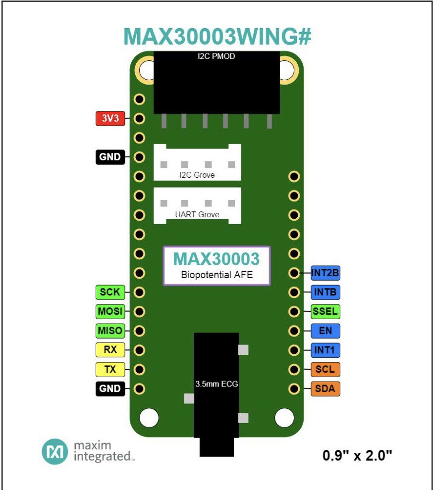

# MAX30003 ECG Logger using Silicon Labs EUSART Bare Metal (SPI)

This project demonstrates how to read real-time ECG signals from the MAX30003 biopotential analog front-end sensor using a Silicon Labs MCU. The communication between the MCU and MAX30003 is established via SPI, and the data is sent over the virtual COM port (VCOM) using EUSART in a bare-metal (no RTOS) environment.

The received ECG data is streamed to the host computer via USB and logged as both raw and converted millivolt (mV) values.

## Project Overview

- **Platform:** Silicon Labs MCU (tested with EFR32MG24B310F1536IM48)
- **Sensor:** MAX30003 
- **Communication:** SPI (Sensor to MCU), UART (MCU to PC)
- **Gain:** ~20 V/V  
- **Sampling Rate:** ~150 Hz
- **Output Format:** `raw` and `mV` values

## Key Files

| File            | Description                                                                 |
|-----------------|-----------------------------------------------------------------------------|
| `app.c`         | Main application logic for SPI initialization, sensor data read, and UART output |
| `max30003.c`    | SPI communication driver and data handling for MAX30003                    |
| `max30003.h`    | Header file for MAX30003 register maps and function declarations           |

## Example Output

Data will be logged in the format:
```
raw, mv
11520, 0.328
11510, 0.326
…
```
## Viewing Output in Terminal

After reconnecting your EFR32MG24 board
```
ls -l /dev/tty.*
```
Find the correct device name (e.g. /dev/tty.usbmodem14101), then run:
```
screen /dev/tty.usbmodem14101 115200
```
# MAX30003 Register Configuration for Sampling Rate and Gain

To configure the MAX30003 for ECG sampling and gain settings, use the following two register write commands:

## 1. CNFG_GEN (Register 0x10)
```c
max30003_write_register(0x10, 0x180000);  // CNFG_GEN: FMSTR=01, EN_ECG=1
```

Sets FMSTR = 01 → 32.768kHz master clock. Enables ECG channel via EN_ECG = 1.  
**Note:** This line is required because 125Hz sampling is only valid when the master clock is set to 32.768kHz.

---

## 2. CNFG_ECG (Register 0x15)
```c
max30003_write_register(0x15, 0x800000);  // CNFG_ECG: RATE=10 (125 sps), GAIN=00 (20 V/V)
```

Sets:
- **RATE = 2** → 125Hz sampling rate
- **GAIN = 0** → 20 V/V gain (default)

This setting is only effective when FMSTR = 01 is already set in CNFG_GEN.

---

## 3. GAIN Configuration (bit[17:16] in CNFG_ECG)

The GAIN can be adjusted by modifying bit[17:16] in register 0x15:

| GAIN | bit[17:16] | Register Value | Conversion Formula |
|------|-----------|----------------|-------------------|
| 20 V/V | 00 | 0x800000 | ÷(131072×20) |
| 40 V/V | 01 | 0x810000 | ÷(131072×40) |
| 80 V/V | 10 | 0x820000 | ÷(131072×80) |

### Examples:

**125 Hz + 20 V/V (default):**
```c
max30003_write_register(0x15, 0x800000);
// Update conversion: / (131072.0f * 20.0f)
```

**Important:** When changing GAIN, you must also update the `max30003_convert_to_mv()` function with the corresponding divisor.

---

# Hardware Connections
| MAX30003 Sensor | EFR32MG24 Pin |
|--------|--------------|
| VCC (3.3V) | Pin 20 |
| GND | Pin 1 |
| SCLK | Pin 8 (PC01) |
| MOSI | Pin 4 (PC03) | 
| MISO | Pin 6 (PC02)| 
| CS (SSEL)   | Pin 10 (PA07)|

<br/>

<div style="display: flex; gap: 20px; align-items: flex-start;">

  
  

</div>

